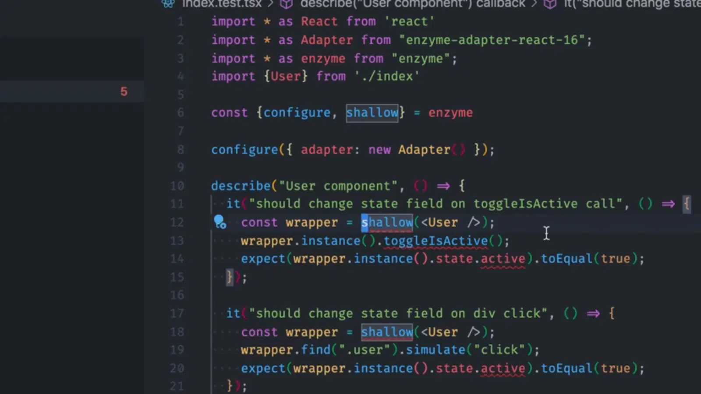

## Work of Art

I learned that, with art, visually appealing structures should be off-centered or asymmetrical. However, a lot of people might disagree with that. Some people like things very centered, uniform and compact. A simple design. Many things follow a conformity. Sports, architecture, desk space. When it comes to exercise, even if a lifter has a muscle imbalance, they should still use the same weight on both arms, doing the same amount of repetitions. As humans, we tend to follow a somewhat strict formula. Wake up, exercise, work, relax, then sleep. A simple day in the life. There are times when we want to stray away from the norm. But is that a feasible option?

Formatting code is not necessarily a difficult thing to do, however it can become tedious and very easy to gloss over. A cool thing about coding is that you can either code in a tight woven structure, or just code everything on one line. They both will run properly, but which one is better for the next person to read, or even yourself in a few weeks?

Over the years of hundreds of coding languages, developers insist that there should be a coding standard. Where lines of code are properly spaced out, there are indentations where it is required, and there are no missing statements or variables.

## ESLint

That is where ESLint comes into play. With a great IDE, IntelliJ IDEA, users are able to install a plugin that tells them where their code can be improved based on certain coding standards. The code will be highlighted, or underlined with a color that is eye-catching so the user can instantly spot it. Fixing these inconsistencies in order to conform to the coding standards is very important as it can prevent or even solve some errors that will occur due to a missing parenthesis or semicolon.

## Improvement Incoming

After writing C and C++ in the terminal and then jumping back to a proper IDE, I realized how much more improvement I need with my indentations. Especially when working on Workouts of the Day, I find that my code is never indented, minimal spacing, or not using single quotes. I predict that after a few weeks of ESLint telling me what I am doing wrong, I will no longer need to be corrected and then I should be able to write flawless code that is so readable, other programmers will jump to read it.
