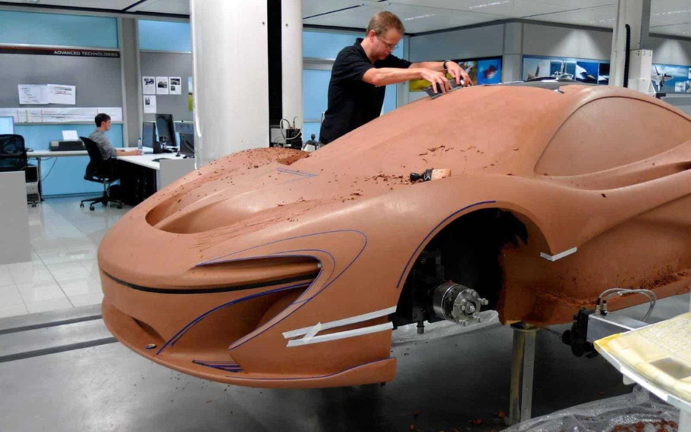

## Exploring Fundamental Software Engineering Concepts Beyond Web Application Development

Throughout this course in software engineering, I've delved into various fundamental concepts that extend far beyond the scope of web application development. The curriculum encompassed a rich array of topics, each holding substantial significance in the broader domain of software engineering. I will focus on two critical facets: Agile Project Management and Design Patterns, elucidating their broader applicability and implications beyond web applications.

Agile Project Management is a dynamic methodology that emphasizes adaptability, collaboration, and iterative development. Within this framework, one prominent approach we explored was Issue Driven Project Management (IDPM). IDPM breaks down projects into manageable, actionable issues or tasks, fostering transparency and promoting incremental progress. Its applicability extends well beyond web applications, finding relevance in diverse project contexts. For instance, envision employing IDPM in the development of an artificial intelligence system or a hardware integration project. The core essence of breaking down complex tasks into smaller, actionable units while maintaining flexibility and stakeholder involvement remains universally applicable.

Consider an AI project where the goal is to develop an algorithm for medical image analysis. Applying IDPM here involves decomposing the project into smaller components: data collection, algorithm development, testing, and validation. Each stage is segmented further into specific issues, such as data preprocessing, feature extraction, model training, and performance evaluation. This systematic breakdown allows for continuous evaluation and adaptation, ensuring alignment with evolving requirements or technological advancements.

Furthermore, Design Patterns constitute reusable solutions to common problems encountered in software design. They encapsulate best practices and proven solutions, enhancing code readability, maintainability, and scalability. An example is the Observer Pattern, where objects (observers) subscribe to and receive updates from a subject when its state changes. This concept transcends web development and can be employed across various software domains.

Imagine implementing the Observer Pattern in an IoT (Internet of Things) ecosystem. Sensors acting as observers subscribe to a central hub (subject), receiving updates when certain environmental parameters shift. This pattern facilitates a decentralized, scalable system where components remain loosely coupled yet interconnected, crucial in IoT architectures.

In conclusion, the quintessence of software engineering extends well beyond web application development. Concepts like Agile Project Management, exemplified by IDPM, and Design Patterns transcend specific technological domains. They offer adaptable methodologies and reusable solutions applicable across a spectrum of software engineering endeavors, ranging from AI and IoT to system integration and beyond. Understanding and mastering these foundational principles equip software engineers with a versatile toolkit essential for navigating the complexities of diverse projects in today's dynamic technological landscape.