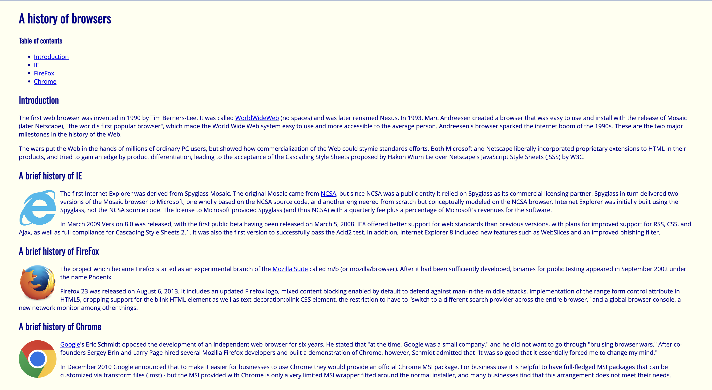
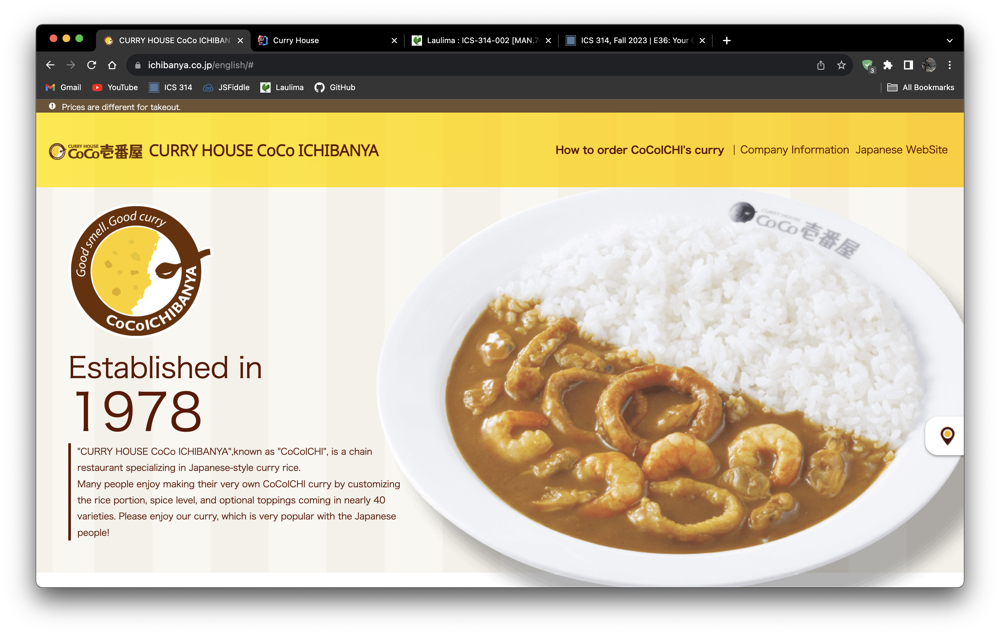

### Way harder than it looks
For many years, the conception of school websites, intramural league home pages or even some clothing online stores was that they just had lazy designers or anyone else could do better… Just in a few weeks of using just HTML and CSS, how wrong could I be.
Should-be simple things such as making three columns can be a headbanger. Having to float sections to one side of the screen, and resizing the width… If only there was something that was premade by someone way more competent than I am, so I could use that and not have to look at my old code for references.

### Frameworks!
With a nice thing called Bootstrap, a framework for HTML, we are able to create sections with classes that define its visual properties. Things such as making rows and columns, moving something to the center, which would be a pain in the butt not too long ago. Also, compatibility with mobile devices or just having a small browser window.

### What should I do?
That all sounds nice and all, but is it really that easy? Yes and no. Yes it has a lot of classes at your disposal and eliminates the pages of CSS attributes you would have to type out before, but will you know what classes to use? Is it just a simple Google search? Throughout the last few weeks I had a hard time figuring out what classes to use for certain things such as aligning text to one side, too much padding on my paragraph tags, and just other things that are difficult to understand especially when just starting out.

But it is a journey that we all have to go through as programmers. Nothing is easy! Even after failing to finish building a webpage in less than an hour, I feel some sort of nirvana after all that pain. I just want to do some more, or try again with newfound knowledge.

### Some projects

Here are some examples of code without a framework and with a framework.

Below is my effort in recreating a website that did not utilize Bootstrap and then with Bootstrap. It was much harder than I thought it would be.

