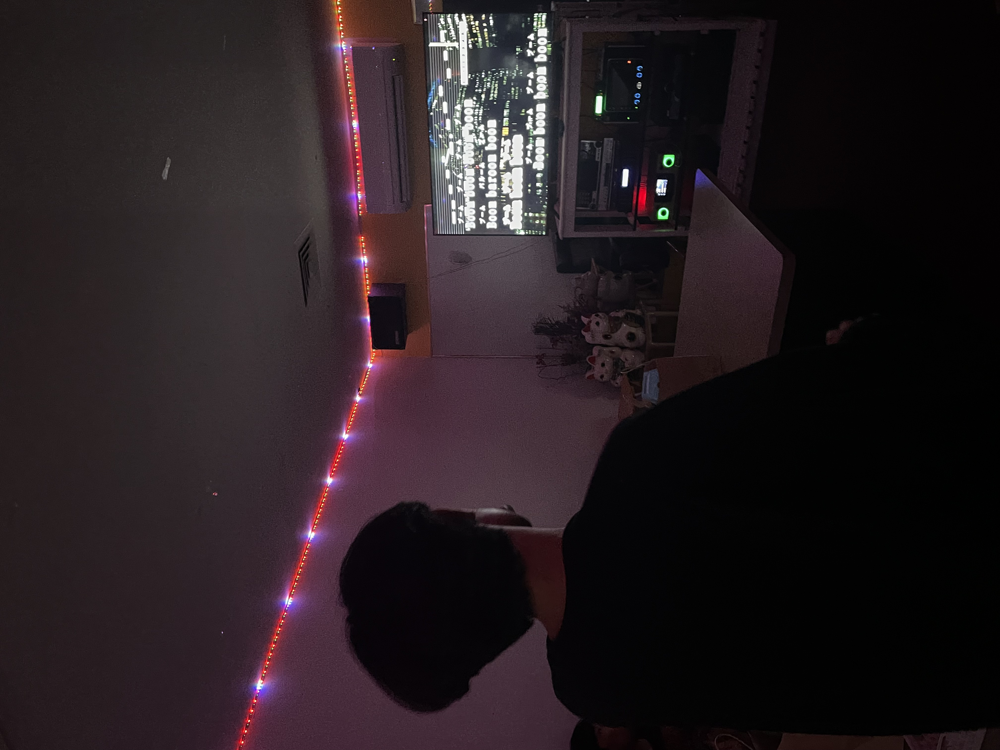
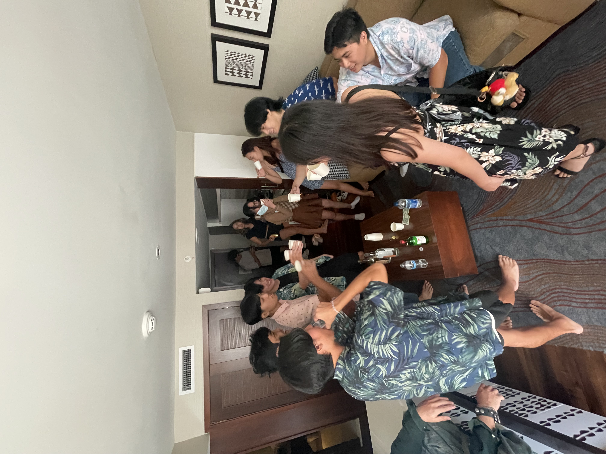

Our goal, to party.

We needed to plan thouroughly.

## Planning Commences

Creating an interary document seemed like a great idea. It probably took us about three hours to figure out what we needed to buy, the hotel we want to stay at and what activities we should do during our residence there.

I mapped out an hour by hour plan on the locations we should go to and what are our goals there and by what time we should finish.

## Game Day

We talk extensively in our discord server. Gathering information on who is able to go, what to wear, and what our procedures are when we get to the hotel.

I begin by checking into the hotel, moving tables around, keeping everything clean.

Now it is time to welcome the guests. We spend time just talking and then we finally go out.

Once we came back, party time. Playing some fun games, eating, talking story, walking around town, just... so much fun.

From this small project, I slightly gained some planning skills, working with peers while also considering their wants and needs to accomodate for everyone. I learned that I will have to make some sacrifices and also have everyone meet eachother halfway when it comes to something like this. In future endevors, I hope to improve my communication skills and try to be more direct in order to more efficiently expedite the process.
